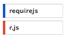
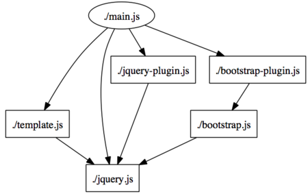
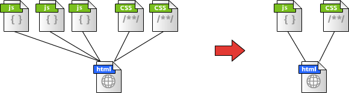

# advanced-requirejs

!SLIDE

# Advanced RequireJS

### what we can improve by RequireJS

!SLIDE left

# What is RequireJS

* RequireJS is a AMD loader
* [AMD](https://github.com/amdjs/amdjs-api/wiki/AMD) means:
    * **A**synchronous
    * **M**odule
    * **D**efinition
* A mechanism for defining modules, their dependencies can be asynchronously loaded. 

!SLIDE

# like this

```javascript
define(['jquery'], function($){
  // you can use $ as local variable
  $('#message').text('Hello, world!');
});
```

```coffeescript
define ['event','header/view','header/server'], (event, view, server) ->
  view.on 'logout', ->
    server.logout()

  event.on 'change-tab', (e) ->
    view.updateTitle e.activeTab
```

!SLIDE

# <font color="red">HOT</font> technology!




by Google Trends

!SLIDE left

# see also
* [requirejs.org](http://requirejs.org/)
* [github.com/jrburke/requirejs](https://github.com/jrburke/requirejs)
* [github.com/eller86/requirejs-best-practice](https://github.com/eller86/requirejs-best-practice)

!SLIDE

# HOW to use?


!SLIDE

# Case #0

## Managing multiple JS files

resolve dependency to load them correctly

!SLIDE

## Complex dependency



!SLIDE

## Decide order automatically

like 拓撲排序 (tàpū páixù)

1. ./jquery.js
2. ./template.js
3. ./jquery-plugin.js
4. ./bootstrap.js
5. ./bootstrap-plugin.js
6. ./main.js

!SLIDE

# Case #1

## Optimization

zip and compress all resource into one file

!SLIDE

## Reduce communication

between browser and server



!SLIDE

# Case #2

## Dynamic switching

judge module to load on demand

<table>
  <thead>
    <tr><th>device \ page</th><th>sign in</th><th>portal</th><th>common</th></tr>
  </thead>
  <tbody>
    <tr><th>PC only</th><td>-</td><td>collapsable menu</td><td>-</td></tr>
    <tr><th>iPhone only</th><td>link to AppStore</td><td>diggable menu</td><td>-</td></tr>
    <tr><th>common</th><td>validator plugin</td><td>news board</td><td>framework</td></tr>
  </tbody>
</table>

!SLIDE

## Switching module

Load A for retina screen, load B for others

```javascript
define(['is!high-resolution?retinaLoader:defaultLoader'],function(imageLoader){
  var image = imageLoader.load('apple');
  $('#sample-image').append(image);
});
```

!SLIDE

# Try it!
